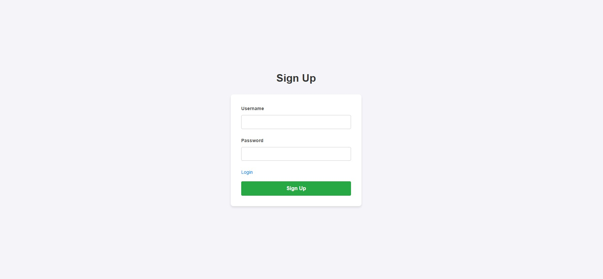
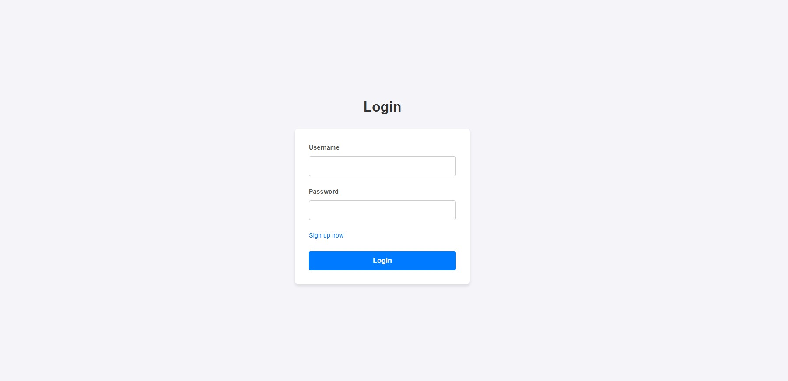
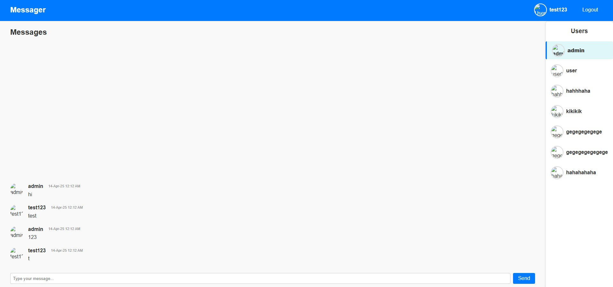
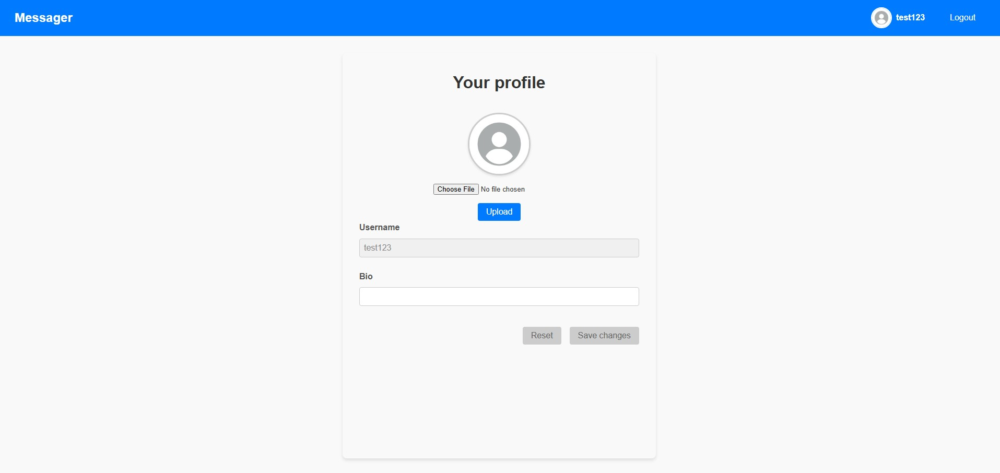

# odin-messaging-app

## Core Functionality

1. Authorization
2. Send messages(from one user to another user)
3. Manage user profile

## UI
Sign up page

Login page

Messages page

User profile page

## Data model

### User

- `id` (Primary Key)
- `username` (Unique)
- `email` (Unique)
- `password` (Hashed)
- `profile_picture` (Optional)
- `created_at` (Timestamp)

### Message

- `id` (Primary Key)
- `sender_id` (Foreign Key to User)
- `receiver_id` (Foreign Key to User)
- `content` (Text)
- `timestamp` (Timestamp)
